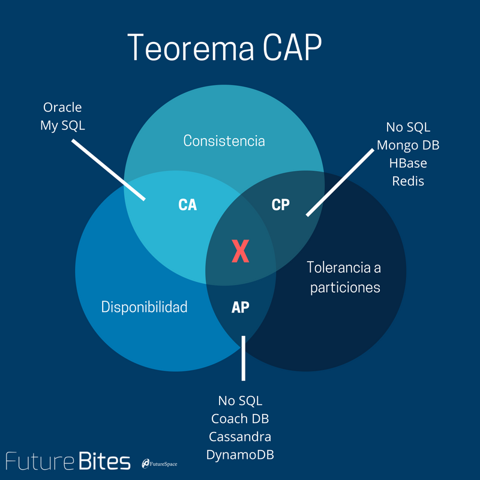

## CAP 理论解释

CAP 理论:一个系统最多能同时满足一致性（Consistency），可用性（Availability），和分区容错性（Partition tolerance）这三项中的两项.



- 一致性（Consistency）指的是强一致性，每次访问都能获得最新数据但可能会收到错误响应 .
- 可用性（Availability） 每次访问都能收到非错响应，但不保证获取到最新数据。指的是工作中的系统，任何一个工作中的节点，每次访问都能返回一个非错的结果。
- 分区容错性 （Partition tolerance）在任意分区网络故障的情况下系统仍能继续运行 s

### CAP 可用性


假设如图示，两个数据节点。中间发生了网络分区。一部分用户访问第一个节点，另一部分用户访问第二个节点。某一个时刻网络  发生了问题，此时显然有两个选择

- 继续允许访问写数据库，但是就造成了数据不一致的情况。
- 为了保持数据一致性，此时就停止接受读写操作，直到网络恢复。这样违反了可用性原则，数据库运行中的节点，无法接受请求。

```
实际的系统中 就算违反了CAP的可用性，但是还是成功的处理着请求。所以当一个系统选择了一致性，这并不一定意味着网络发生问题的时候一定服务当级。还可以把用户流量转到主数据库，用户就毫无感知。

实际应用中的可用性和CAP的可用性并不相同。应用中的可用性是通过SLA来衡量。（比如99.9%的正确的请求一定要在一秒钟之内返回成功），但是一个系统无论是否满足CAP可用性其实都可以满足这样的SLA。
```

### 啥都不是的系统

一个 master，slave 的系统。用户不访问主库就不能写入数据。所以就不符合 CAP 中的可用性。
如果从 slave 里那里读到的数据，有一定延迟，所以也不符合一致性要求。所以这个系统 CA 都不满足。

### Availability Patterns

Fail-over 冷备，热备，主从切换

Replication
_ Master-Slave 主从
_ Tree replication
_ Master-Master
_ Buddy Replication

### scalability trade off

- performance vs scalability
  性能问题，系统在有一个用户访问的时候就很慢。
  扩展性问题，系统在一个用户访问的时候很快，很多人访问的时候就变慢了。

- Latency vs Throughput
  目标是在一个可以接受的延时下，最大化吞吐量，

- Availability vs Consistency

scale up vs scale out

scale up 扩展单机的性能，纵向扩展
scale out 添加更多的机器。横向扩展

### zookeeper

zookeeper 通常被认为是一个 CP 系统。采用了 consensus 算法。但是默认页不提供一致性操作。需要调用 sync[https://blog.the-pans.com/cap/]。

### Load Balancer

DNS 轮训 A 地址可以添加 IP。输入域名 IP 切换。缺点是 DNS 的缓存时间太久

L3 负载均衡 有 IP 地址和 PORT 或者 三层负载均衡可以根据 IP 和 port 转发
L4 负载均衡 会话层负载均衡 可以识别 TCP 协议。

L7 负载均衡 7 层是应用层。所以会解析 HTTP 协议。业务上可以根据 cookies，或者 HTTP 报文的内容来进行负载

负载均衡的算法：

- round robin 一个接一个
- weighted round robin 根据配置的权重来轮训 1:5
- Random 随机
- Least busy 最少负载
- cookie/session 保持
- 根据参数

### Cache

- 直写模式
  

```
1. 用户的写入请求 先写入缓存
2 存入DB，
3 返回给用户成功
```

缺点：
1 写入的数据可能永远不会被读到。TTL 可能会缓解这个问题。
2 速度很慢，因为要写入 DB

- 回写模式
  

```
 1 写入缓存
 2 在队列中添加一个事件
 3 返回给用户
 4 异步队列里处理之前加入的数据，并且写入DB
```

缺点：
异步的，可能 DB 还没存储，缓存丢了此类数据。

- 刷新
  
  提前将 DB 的数据灌入缓存，然后访问的时候访问缓存。

缺点：需要预测未来将要使用的数据。

- 过期策略
  TTL
  FIFO
  LIFO
  LRU
  显示标记过期时间

### 数据库

ACID
BASE
反模式
Sharding

#### MYSQL

MYSQL 集群

sharding

#### NOSQL
